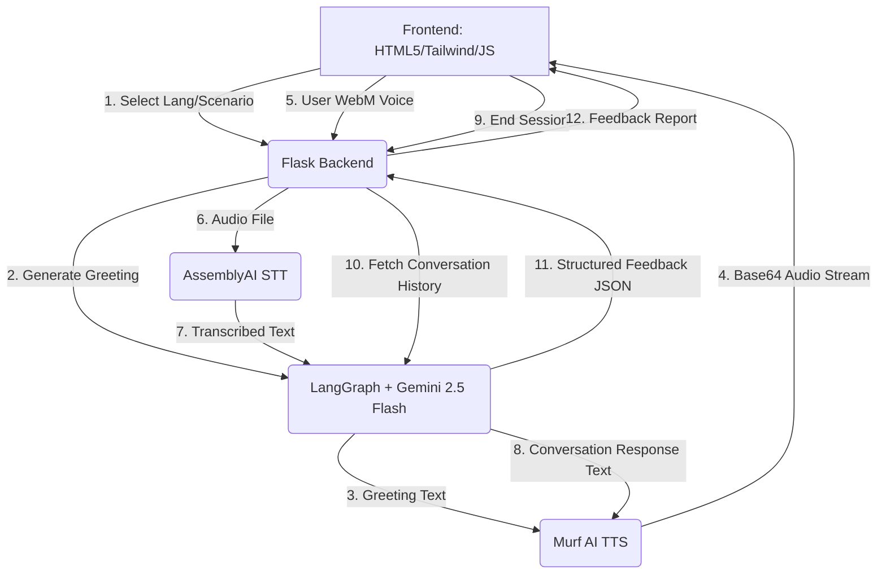

# LinguaAI — AI Language Conversation Coach

LinguaAI is an interactive, voice-based AI Language Conversation Coach designed to help learners practice real-world scenarios in multiple foreign languages. Powered by an advanced AI agent architecture, the system provides real-time voice conversations, automated transcription, speech-to-text alignment, contextual text-to-speech feedback, and structured session feedback reports.

---

## 📸 User Interface Preview & Walkthrough

Here is the step-by-step user journey of using **LinguaAI**:

### 1. Welcome & Hero Dashboard


### 2. Language Selection


### 3. Scenario Selection & Session Activation


### 4. Active Conversation Session (Nancy Speaking)


### 5. Session Complete & Performance Ratings


### 6. Detailed Analytical Feedback Report


---

## 🚀 Key Features & Functionality

### 1. Multi-Language & Scenario Selection
- **Interactive Flags & Selection:** Supported languages include **French, Spanish, Hindi, Japanese, German, Telugu, and Tamil**. Users choose their target language via beautifully animated cards with national flag icons.
- **Real-Life Scenarios:** Once a language is selected, learners can choose one of several conversational situations:
  - *Ordering Food at a Restaurant*
  - *Asking for Directions*
  - *Job Interview*
  - *Shopping at a Market*
  - *Hotel Check-in*
  - *Visiting a Doctor*
- **Dynamic Lock Flow:** The "Begin Session" interface activates only after selecting both a language and a scenario.

### 2. Conversational Agent Flow (LangGraph-Powered)
- **Session-Based State Memory:** Integrates LangGraph's conversational agent framework with `InMemorySaver` to store chat history across messages on a specific thread.
- **Dynamic 5-Exchange Rule:** Sessions are limited to exactly 5 conversation exchanges. Progress is tracked and shown dynamically on the UI (e.g., `Exchange 1/5`, `2/5`).
- **Contextual Target Response:** The coach (Nancy) speaks entirely in the target language (1-2 sentences) and references only what the learner *actually* said.
- **Embedded Grammar Tips:** In each turn, the AI appends a translation/grammar tip inside `[brackets]` in English (e.g., `[Tip: "Je voudrais" is more polite than "Je veux"]`).
- **Closing/Termination:** At the 5th exchange, Nancy provides a closing greeting, and the conversation is marked complete.

### 3. Speech-to-Text (STT) via AssemblyAI
- **Browser-Based Recording:** Audio response recording uses the browser's `MediaRecorder` API with an optimized `audio/webm;codecs=opus` codec.
- **Visual Pulse Animations:** The microphone button pulses in red while recording.
- **Dynamic Language Detection:** The audio is sent to the backend as `FormData` and transcribed using AssemblyAI's `universal-3-pro` / `universal-2` models with language-specific transcription codes matching the selected language (e.g., `fr`, `es`, `ja`).
- **Graceful Fallbacks:** Empty or failed recordings fall back to a default value to maintain flow.

### 4. Text-to-Speech (TTS) base64 Audio Streaming via Murf AI
- **Low-Latency Streaming:** Nancy's text responses are converted into audio streams in real-time using Murf AI's global streaming endpoint (`FALCON` model).
- **Voice Mapping:** Uses localized voices matching the target language:
  - **French:** `fr-FR-axel`
  - **Spanish:** `es-ES-elvira`
  - **Hindi:** `hi-IN-namrita`
  - **Japanese:** `ja-JP-kimi`
  - **German:** `de-DE-josephine`
  - **Telugu:** `te-IN-navya`
  - **Tamil:** `ta-IN-abirami`
- **Real-time Playback:** Streams base64-encoded chunked MP3 audio directly to the frontend, played instantly via HTML5 Audio and the AudioContext API. Shows a dancing wave sound animation while Nancy is speaking.

### 5. Detailed Performance Analytics & Feedback
- **JSON Report Analysis:** After the 5th exchange (or if ending early), the backend uses Gemini 2.5 Flash to analyze the conversation history and generate a structured JSON feedback payload.
- **Interactive UI Metrics:**
  - **Fluency & Grammar Accuracy Scores (1-10):** Rendered as beautiful circular SVG progress meters.
  - **Vocabulary Range Indicator:** Assesses vocabulary level (`basic`, `moderate`, or `advanced`).
  - **Mistakes Analysis Table:** Details exactly what was said, the correct correction, and the underlying grammar rule.
  - **New Vocabulary Tags:** Highlights new words to learn, shown as styled pills.
  - **Practical Conversation Tip:** Gives customized coaching advice for improvement.

---

## 🛠️ Architecture & Tech Stack



- **Frontend:**
  - HTML5, Tailwind CSS (via CDN)
  - Vanilla JavaScript for media recording, streaming playback via `AudioContext`, DOM updates, and SVG animation triggers.
  - FontAwesome icons.
- **Backend:**
  - Python / Flask web application with Flask-CORS enabled.
  - LangChain + LangGraph integration.
  - AssemblyAI official SDK (`assemblyai`).
- **AI Models & Web Services:**
  - **Google Gemini 2.5 Flash** (via LangChain's `init_chat_model`).
  - **Murf AI streaming API** for real-time text-to-speech.
  - **AssemblyAI** Speech-to-Text API for transcription.

---

## 📁 Project Directory Structure

```text
├── backend/
│   ├── app.py             # Flask Server, Agent logic, AssemblyAI/Murf AI endpoints
│   ├── .env               # API Keys & Configurations
│   └── __pycache__/
├── frontend/
│   ├── index.html         # Application Markup & Design Layout
│   └── index.js           # Client-Side Application Logic (audio recorders, fetch, visuals)
└── images/                # Application Screenshots and Assets
```

---

## ⚙️ Setup & Installation Instructions

### Prerequisites
Make sure you have API credentials for the following services:
1. **Google Gemini API Key** (from Google AI Studio)
2. **Murf AI API Key**
3. **AssemblyAI API Key**

### 1. Backend Setup
1. Navigate to the `backend` directory:
   ```bash
   cd backend
   ```
2. Install the necessary Python packages:
   ```bash
   pip install flask flask-cors python-dotenv langchain langchain-community langgraph assemblyai requests
   ```
3. Create a `.env` file inside the `backend/` folder:
   ```env
   GOOGLE_API_KEY=your_google_gemini_api_key
   MURF_API_KEY=your_murf_ai_api_key
   ASSEMBLYAI_API_KEY=your_assemblyai_api_key
   ```
4. Start the Flask server:
   ```bash
   python app.py
   ```
   *The backend will run on `http://127.0.0.1:5001`.*

### 2. Frontend Setup
1. Since the frontend is written in static HTML, CSS, and JS, you can run a simple HTTP server or directly open it in your browser.
2. For example, run a server inside the `frontend` folder:
   ```bash
   cd ../frontend
   python -m http.server 8000
   ```
3. Open `http://localhost:8000` in your web browser.

---

## 🔌 API Routes Reference

### `POST /start-session`
- **Description:** Initializes a brand new LangGraph agent instance with a clean `InMemorySaver` checkpointer. Generates Nancy's first greeting.
- **Payload:**
  ```json
  {
    "language": "French",
    "scenario": "ordering food at a restaurant"
  }
  ```
- **Response:** Audio stream (`text/plain` base64 encoded MP3 chunks).

### `POST /submit-response`
- **Description:** Receives the user's recorded `.webm` audio, transcribes it via AssemblyAI, sends the text to the LangGraph memory thread, generates the next response from Gemini, and streams the new response voice.
- **Payload:** Multipart/FormData containing:
  - `audio`: The recorded `.webm` file
- **Response:** Audio stream with headers:
  - `X-Exchange-Number`: Current exchange count (integer)
  - `X-Session-Complete`: Set to `"true"` if the 5th exchange is reached.

### `POST /get-feedback`
- **Description:** Analyzes the complete LangGraph conversation history thread and generates custom grammar corrections, fluency scores, and coaching tips.
- **Response:**
  ```json
  {
    "success": true,
    "feedback": {
      "language": "French",
      "scenario": "ordering food at a restaurant",
      "fluency_score": 7,
      "grammar_accuracy": 6,
      "vocabulary_range": "moderate",
      "grammar_mistakes": [
        {
          "said": "Je veux un cafe",
          "correct": "Je voudrais un cafe",
          "rule": "Use 'voudrais' (conditional) for polite requests."
        }
      ],
      "new_words_to_learn": ["le café", "s'il vous plaît", "une boisson"],
      "conversation_tip": "Keep practicing conditional verbs to improve politeness in restaurant scenarios!"
    }
  }
  ```
